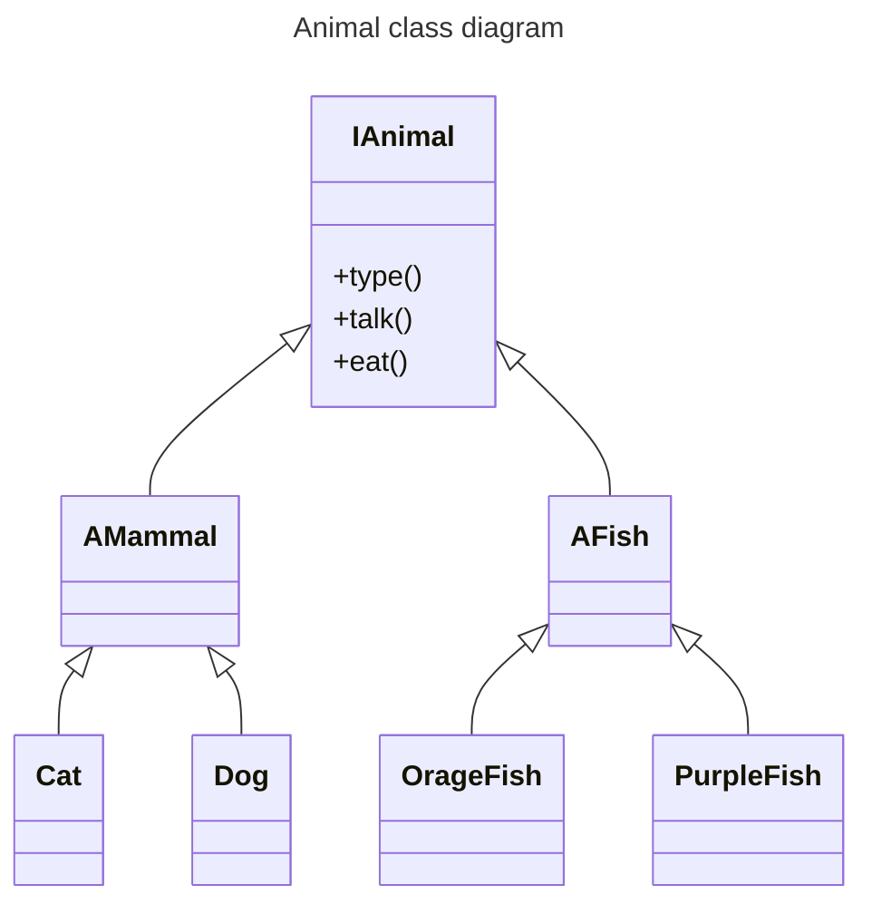

[//]: # (sandbox_idea: arq/basics)
[//]: # (sandbox_name: static_vs_dynamic_design)
[//]: # (sandbox_description: how to split static and dynamic design implementation)
[//]: # (sandbox_env: markdown)

# static vs dynamic design

Static design identifies the different concepts of our application, dynamic design defines how and when does concepts interacts among themselves.

Static design is much easier to reuse in other applications for this reason is key to split implementation in a way that dynamic design implementation is isolated from concept definitions.

Lest take a look to polymorphism.cpp example:

## Concept definition

polymorphism example defines what an animal is and how different types of animals implements IAnimal contract.



### Types

There are two types of animal on the example, mammals and fishes and are identified by an enum:

[//]: # (sandbox_idea_link: file:arq/basics/polymorphism.cpp id:TYPE)
```cpp
// animal types
enum class Type { MAMMAL, FISH };
```

### Contract

Our interface IAnimal defines the contract of what an animal is, on this case is something that can say which type of animal is and is able to talk and to eat:

[//]: # (sandbox_idea_link: file:arq/basics/polymorphism.cpp id:IANIMAL)
```cpp
// define contract animal with is something that talks and eats
// I stands for Interface
class IAnimal {
public:
  virtual Type type() noexcept = 0;
  virtual void talk() noexcept = 0;
  virtual void eat() noexcept = 0;
};
```

### Mammal Implementation

The different types of animals have common characteristics that makes them to have similar mechanisms so we can create two base classes one per animal type.

Therefore we have one abstract class plus two implementations one for Cats and another for Dogs:

[//]: # (sandbox_idea_link: file:arq/basics/polymorphism.cpp id:MAMMAL)
```cpp
// all mammals does same sound eating
// A stands for Abstract
class AMammal : public IAnimal {
public:
  Type type() noexcept override { return Type::MAMMAL; }
  virtual void eat() noexcept override {
    std::cout << "crunch crunch" << std::endl;
  }
};

class Cat : public AMammal {
public:
  void talk() noexcept override { std::cout << "meow meow" << std::endl; }
};

class Dog : public AMammal {
public:
  void talk() noexcept override { std::cout << "wof wof" << std::endl; }
};
```

### Fish Implementation

Same as mammals, here we have an abstract class with common functionality and two implementations, one for OrangeFish and another for PurpleFisf:

[//]: # (sandbox_idea_link: file:arq/basics/polymorphism.cpp id:FISH)
```cpp
// abstract class for fishes
class AFish : public IAnimal {
public:
  Type type() noexcept override { return Type::FISH; }
  virtual void talk() noexcept override {
    std::cout << "glup glup" << std::endl;
  }
  virtual void eat() noexcept override {
    std::cout << "slurp slurp" << std::endl;
  }
};

class OrangeFish : public AFish {
public:
  void talk() noexcept override { std::cout << "..." << std::endl; }
};

class PurpleFish : public AFish {
public:
};
```

## Dynamic implementation

Dynamic design defines how and when diferenct components interact, it can be observed from different levels of abstraction, on the higher level we have the use cases design.

Use cases implementation as whole have a very low reusability potential, but lower level concepts can have better potential.

For example, here we have the top level use case implementation on main function:

[//]: # (sandbox_idea_link: file:arq/basics/polymorphism.cpp id:MAIN)
```cpp
int main(void) {
  Cat c{};
  Dog d{};
  OrangeFish of{};
  PurpleFish pf{};

  std::array<IAnimal *, 4> zoo{&c, &d, &of, &pf};

  for (auto animal : zoo) {
    feed_animal(*animal);
    if (animal->type() == Type::FISH) {
      // try to avoid this type of casts
      talk_with_fishes(*static_cast<AFish *>(animal));
    }
    std::cout << std::endl;
  }

  return 0;
}
```

More atomic functionality is implemented in different free functions:

Feed for example is a generic behaviour that can be reused in several applications, something like feed animal can be used in zoo app or animal store app, it is atomic enough to be shared among apps, but there is a high chance that not all animal related apps need this function or maybe this function does not feet exactly the requirements so it is necessary to implement a very similar function but not exactly the same:

[//]: # (sandbox_idea_link: file:arq/basics/polymorphism.cpp id:FEED)
```cpp
// feed any type of animals
void feed_animal(IAnimal &animal) {
  animal.talk();
  animal.eat();
}
```

Same with talk_with_fish function:

[//]: # (sandbox_idea_link: file:arq/basics/polymorphism.cpp id:TALK)
```cpp
// talk only with fishes
void talk_with_fishes(AFish &fish) { fish.talk(); }
```

## Reusability potential

Static design completely decoupled from dynamic design implementation have an extremely high reusability potential, those animal concepts can be used in zoo app or animal store app or any other app related to animals.

If we follow OCP any project that uses those components can contribute to improve it and all apps that uses it can benefit from collaboration.
